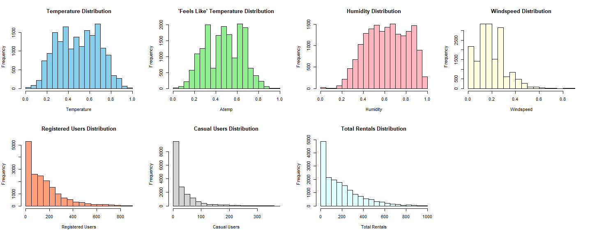
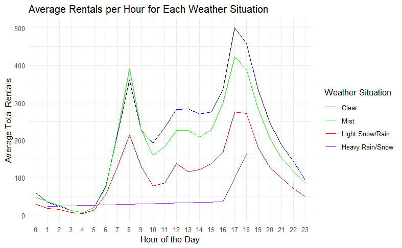
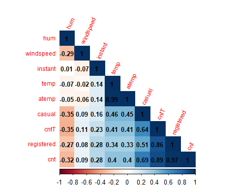
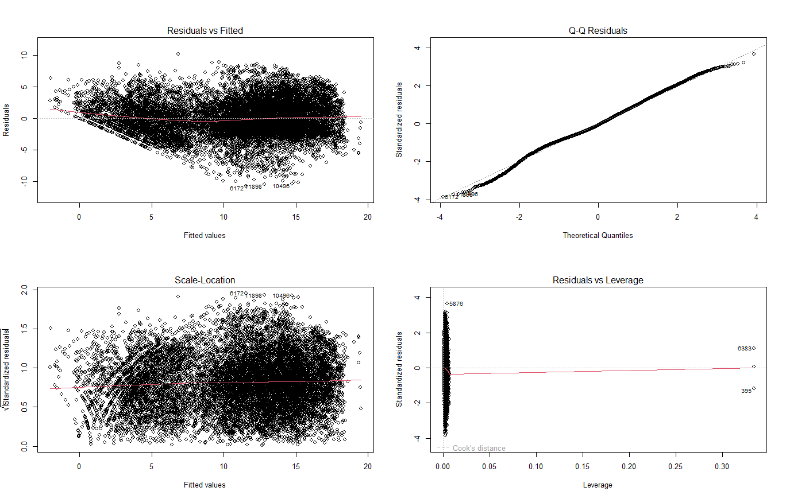
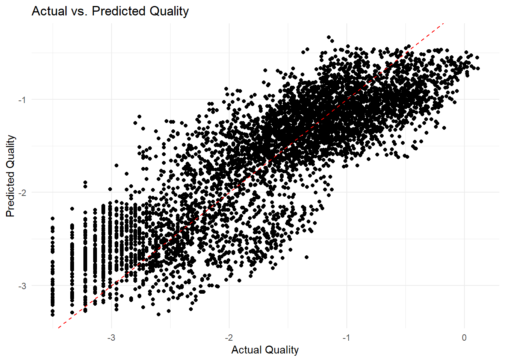

# Predictive Modeling of Capital Bike Share Rental Demand

## 1. Introduction
### 1.1 Abstract
My Company, KB Consulting LLC, has taken a project to develop a predictive model for bike 
rental demand for Capital Bike Share in Washington D.C., using a dataset of 17,379 observations. 
Employing a 70:30 data split for training and testing, we conducted an exploratory data analysis 
and feature engineering, including Box-Cox transformation and elimination of redundant features. 
The model, refined to address multicollinearity and heteroscedasticity, was selected based on the 
Bayesian Information Criterion, focusing on temperature, humidity, and time bins. Our findings 
provide insights for optimizing bike availability and maintenance scheduling, contributing to 
efficient service management and sustainable bike share rental business by also helping people use 
the transportation benefit from the health and environmental aspects.
### 1.2 Overview of the Capital Bike Share
Capital Bike Share is a bike sharing rental company based in Washington D.C., known for its userfriendly system by allowing customers to rent bikes from any available location and return them 
to the same or any other station in the city without any other personal involvement. This convenient 
setup attracts both regular members, and casual users like tourists. Capital Bike Share's innovative 
approach has made significant contributions to sustainable transportation and community wellbeing. In this project, we're working for Capital Bike Share to manage and understand their 
potential demand on when and how the factors affect rental demand.
## 2. Problem Statement
Our main goal is to help the company understand the potential demand for bike share rentals. This 
means figuring out how demand changes based on certain conditions. Aligning the bike 
management system with these changes will improve the service. This improvement involves 
better planning of maintenance schedules to keep bikes in good condition and adjusting the level 
of service. For example, knowing the right time for maintenance and when to increase or decrease 
services can greatly reduce the number of bikes that become unusable. Also, by carefully analyzing 
the data on how bikes are used in different conditions or times, we can assist the company in 
reducing unnecessary costs.
## 3. Methodology
### 3.1 Data Partition
We are utilizing R for detailed exploratory data analysis, employing deep statistical techniques and 
creating visualizatios to identify trends and relationships in the data. We have decided to use 70:30 
data split for training and testing which allows us to confidently assess the model’s predictive 
power. It accounts for its errors more effectively by giving its major portion of the data for training 
which will provide enough exposure to detect any patterns. The 30 % test data helps us to
rigorously evaluate its performance in unseen scenarios, ensuring our model robustness. This 
division is crucial for both developing a reliable model and assessing its performance on new, 
unseen data, considering the unique characteristics and varying frequencies of bike-sharing 
demand.
### 3.2 Exploratory Data Analysis
First, we are interested to see how each numerical variable is distributed. A variable with high 
skewness may indicate more frequent extreme values, which could affect demand prediction 
models. Similarly, understanding the skewness can help in identifying potential biases in data and 
making necessary transformations for modeling. For this specific case we used histogram to 
visualize and understand the distribution. 
Fig.1.0

This plot illustrates the average number count of rentals at different hours of the day. Peaks in the 
graph indicate the times when rentals are most frequent, likely corresponding to rush hours or 
popular biking times. This insight is vital for scheduling maintenance and ensuring availability
during high-demand periods.
Fig 1.1

The above figure shows that a lot of people rent bikes around 5 PM. Having our highest peak on 
workdays which might mean that many people use bike-sharing to get home. What's interesting is 
that this happens almost every day, no matter what the weather is like. This tells us that people 
really count on renting bikes in the evening, regardless of the weather.
### 3.3 Correlation Among Predictor Variables
We plotted correlation between numerical variables to observe their relationship. As observed in 
the chart below, there is a high correlation between temperature and perceived temperature (atemp) 
which is expected.
Fig 1.2

## 4. Feature Engineering
### 4.1 Transformation
We noticed that our bike rental data was unevenly distributed, with most values clustered on one 
side. To address this, we used the Box-Cox transformation, a method that helps to even out the 
data distribution. This makes the data more suitable for our analysis.
### 4.2 Reduction
We refined our data by removing features that didn't directly aid our predictions or were repetitive. 
This included dropping 'instant' as it's just an index, 'dteday' because 'weekday', 'month', and 'year' 
cover the same information, and the separate 'casual' and 'registered' counts, focusing on the total 
rental count ('cnt').
### 4.3 Categorical Variable Transformation and Binning
We've identified essential variables such as 'hr' (hour), 'weekday', 'mnth' (month), 'yr' (year), 
'holiday', 'workingday', 'weathersit', and 'season' that are inherently categorical in nature. The 
transformation of these variables into categorical types is critical because it prevents the model 
from misinterpreting them as numerical values, which could lead to erroneous assumptions. For 
example, our model might perceive weekday 6'as quantitively greater than 'weekday 1'.
### 4.3.1 Binning
For the 'hr' variable, which shows each hour of the day, we grouped hours into categories like 
'Evening Rush' to simplify our analysis. Instead of looking at every single hour, we look at time 
periods that make more sense for understanding bike rental patterns. This makes our analysis 
simpler to handle, while still giving us detailed information.
### 4.3.2 Dummy Variable Encoding
Our multiple linear regression model, like many statistical models, inherently understands 
numerical as 0s and 1s. This numerical interpretation is crucial for the model to process and learn
trends from the data. To encode it, we implemented dummy variable encoding. This process 
converts each categorical variable into a set of binary variables (0s and 1s), each representing a 
specific category.
## 5. Model Building
### 5.1 Initial Model
Our first comprehensive model faced challenges with missing values and multicollinearity. To 
address this, we carried out a “Vector Index Factor” (VIF) analysis, identifying and iteratively 
removing variables that were causing multicollinearity, especially those with values exceeding 
10. Alongside this, we also removed variables that were not significant to the model. This 
process helped us refine and arrive at our best-performing model with root mean square error of 
2.022217 with the explanation power (R-square) of 0.7649 on test data. Here below is the 
mathematical presentation for the best model we achieved. 
y=7.77048069419754+6.98601729335244*atemp−2.89363759912518*hum+0.3466358987757
49*season2+1.27165439727853*season4−5.86622284137807*‘hrbinnedEarlyMorning‘−0.549
06196024029*hrbinnedBrunch−0.465561072767943*hrbinnedLunch−0.388973979982415*we
ekday1−0.411909026417438*weekday2−0.373208442609146*weekday3−0.283203830299214*
weekday4+0.204062481040529*weekday6+0.15386373710491*weathersit2−0.9323763511003
48*weathersit3+0.318409590549216*mnth5−0.195896618816579*mnth11+1.1968584552634*
yr1
Lastly, in Fig 5.1, we examined the residual vs leverage plot. We noticed two observations that 
have a high impact on our model result, and we applied Cooke's distance rule of thumb threshold
for influential variables, which is removing observations exceeding 4/(K-N-1). This removes any 
potential influential observation where K is the number of predictors and N is number of 
observation.
Fig 1.6

Observing fig 1.6, the residual versus fitted values reveals that the variance of the residuals is not 
constant across the horizontal line of fitted values, indicating heteroscedasticity. This condition 
often arises in datasets with skewed distributions and suggests that the relationship between 
independent variables (such as time of day and weather conditions and all other factors) and the 
dependent variable (total count of rentals) may not be strictly linear. Additionally, the QQ plot has 
shown that our assumptions of residual normality are violated. However, as long as we have a 
sufficiently large sample size, the violation of normality assumptions should not significantly 
impact our model. Nonetheless, heteroscedasticity suggests that we should be cautious in relying 
on our model. 
### 5.2 Best Subset selection modelling
We lastly used “Best Subset selection modeling” method to get the best performing model. The 
best subset method provided a visual plot shown below. This plot clearly demonstrated the impact 
of each variable as it was added, guiding us in optimizing our model effectively. 
From Best Subset Selection output, we chose our model guided by the Bayesian Information Criterion 
(BIC). This criterion is preferred as it penalizes the addition of variables, maintaining the simplicity of the 
model while ensuring good performance. After selecting the model, we evaluated its performance on both 
training and test datasets. The model demonstrated a root mean square error (RMSE) of 2.023961 on the 
test data. These metrics indicate that our model is effective in predicting the demand for bicycle rentals. 
Additionally, we created a plot comparing Actual versus Predicted values to visually assess the accuracy of 
our predictions.
Fig 1.8

Here is the mathematical presentation of our Best Subset Selected Model with minimum BIC: 
y=6.9595+6.9448∗atemp+−2.8928∗hum+0.4237∗season_2+1.1749∗season_4+−
4.6435∗‘hrbinnedEarlyMorning‘+1.2281∗hrbinnedBreakfast+0.6761∗hrbinnedBr
unch+0.7534∗hrbinnedLunch+2.34∗‘hrbinnedEveningRush‘+2.4218∗weathersit4
+0.1765∗weekday5
• Feels-Like Temperature (aTemp): The relationship between feels-like temperature and bike 
rental demand is significant, with a high positive coefficient of +6.9448. This suggests that 
as the feels-like temperature increases, so does the demand for bike rentals. However, it's 
important to note that this isn't a simple direct relationship. The impact of temperature is 
modulated by other factors like the season, time of day, and overall weather conditions. For 
instance, a warm afternoon in spring may see higher rental demand than a similarly warm 
evening in autumn.
• Time of Day (hr_binned): The demand for bike rentals fluctuates considerably throughout 
the day. Early mornings, between 0-5 AM, are typically quieter times, as indicated by a 
negative coefficient of -4.6435. In contrast, evening hours, particularly from 16-19, 
correspond to a spike in rentals, shown by a positive coefficient of 2.34. 
• Humidity (Hum): With a coefficient of -2.8928, higher humidity levels are associated with 
a decrease in bike rental demand. 
• Weather and season: Seasonal Coefficients (Season_2 and Season_4 suggest seasonal 
variations in bike rental patterns, with Spring and Winter showing positive impacts on 
demand. A positive coefficient for adverse weather conditions (Weathersit4) is intriguing, 
suggesting an unexpected increase in demand under specific weather scenarios. 
• Weekdays: The slight positive impact of Weekday5 (likely representing Friday) indicates 
a marginal increase in rentals on this day.
Since it is a compound effect understanding this complex relationship is key for managing bike 
rentals effectively. for example, consider a scenario on a Friday in spring, it is an evening rush 
hour around 5PM with a normalized 'feels-like' temperature of 0.576, and the humidity is moderate 
at 30%. With these conditions and based on our model, which has a root mean square error of 
2.023961, we predict the bike rental demand to be approximately the transformed total count rental 
of 13. After back transforming this result, we get 460 of total rental count.
### 6. Recommendations
Optimize bike availability by increasing their accessibility on warm, less humid days, particularly 
during the spring season and evenings, from weekdays specially on Fridays. This period 
experiences a peak in demand, demanding readily accessible bikes, especially around offices due 
to the evening rush. This demand pattern suggests our primary users are likely working 
professionals and students. 
Focus marketing efforts on working professionals and students. Tailor promotional activities to 
their commuting times. For instance, make more bikes available in the evenings near offices and 
in the mornings around residential areas or paths leading to offices. Emphasize the convenience 
and benefits of using our bikes during these peak demand times.
During early mornings and winter months, or when there's high humidity or low temperatures, 
prioritize bike maintenance and redistribution. In these periods of lower demand, manage 
resources efficiently by adjusting the bike fleet and preparing for busier times
